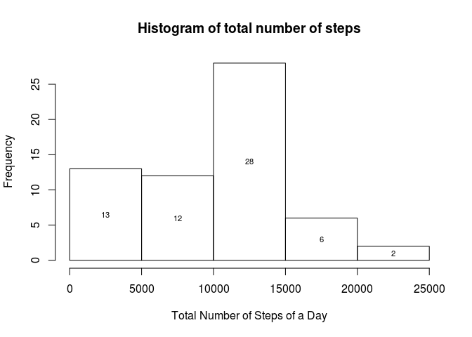
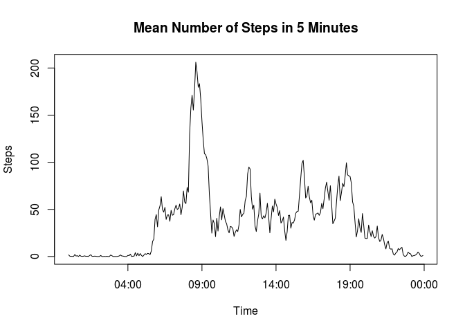
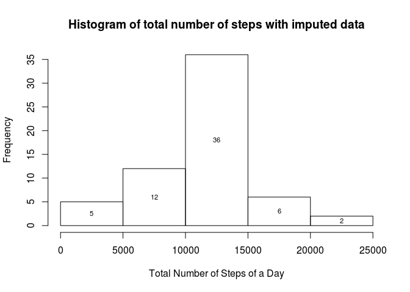
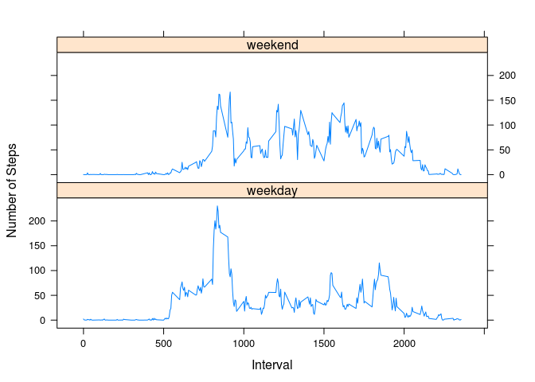

# Reproducible Research: Peer Assessment 1


## Loading and preprocessing the data

```r
data <- read.csv(unz("activity.zip", "activity.csv"), 
header=TRUE, na.strings='NA')
```


## What is mean total number of steps taken per day?

```r
daytot <- tapply(data$steps, data$date, FUN=sum, na.rm=TRUE)
H <- hist(daytot, plot=FALSE)
plot(H, main = 'Histogram of total number of steps',
     xlab = 'Total Number of Steps of a Day', ylab = 'Frequency')
text(H$mids, H$counts/2, labels=H$counts, cex= 0.7)
```



```r
c(mean=mean(daytot, na.rm = TRUE), median=median(daytot, na.rm = TRUE))
```

```
##     mean   median 
##  9354.23 10395.00
```

## What is the average daily activity pattern?

```r
fivemin_mean <- tapply(data$steps, data$interval, FUN=mean, na.rm=TRUE)
library(stringr)
plot(strptime(str_pad(names(fivemin_mean),4,'left','0'), '%H%M'), fivemin_mean,
    type='l', main='Mean Number of Steps in 5 Minutes', 
    xlab='Time', ylab='Steps')
```



### Interval of Maximum Number of Steps

```r
names(fivemin_mean)[which.max(fivemin_mean)]
```

```
## [1] "835"
```

## Imputing missing values

### Total Number of `NA` Values

```r
sum(is.na(data$steps))
```

```
## [1] 2304
```


### Imputing missing values using mean for five minute interval

```r
impute.mean <- function(x) replace(x, is.na(x), mean(x, na.rm = TRUE))
library(dplyr)
data_imp <- data %>% group_by(interval) %>% mutate(steps=impute.mean(steps))
```

### Histogram of the total number of steps taken each day with imputed data

```r
daytot_imp <- tapply(data_imp$steps, data_imp$date, FUN=sum, na.rm=TRUE)
H_imp <- hist(daytot_imp, plot=FALSE)
plot(H_imp, main = 'Histogram of total number of steps with imputed data',
     xlab = 'Total Number of Steps of a Day', ylab = 'Frequency')
text(H_imp$mids, H_imp$counts/2, labels=H_imp$counts, cex= 0.7)
```



### Original Mean and Median vs. Mean and Median with imputed data

```r
c(mean=mean(daytot, na.rm = TRUE), median=median(daytot, na.rm = TRUE), mean_imp=mean(daytot_imp), median_imp=median(daytot_imp))
```

```
##       mean     median   mean_imp median_imp 
##    9354.23   10395.00   10766.19   10766.19
```
Both Mean and Median increase as compared to original data.

## Are there differences in activity patterns between weekdays and weekends?

```r
getdaycat <- function(x) {
    ifelse(weekdays(as.Date(x))=='Sunday' | weekdays(as.Date(x)) == 'Saturday',
        'weekend' , 'weekday')
}
data_imp$daycat <- getdaycat(data_imp$date)
library(lattice)
agg <- aggregate(list(steps=data_imp$steps), by=list(daycat=data_imp$daycat, interval=data_imp$interval), FUN=mean)
xyplot(steps ~ interval | daycat, data = agg, type='l',
       layout = c(1, 2), xlab = 'Interval', ylab = 'Number of Steps')
```



